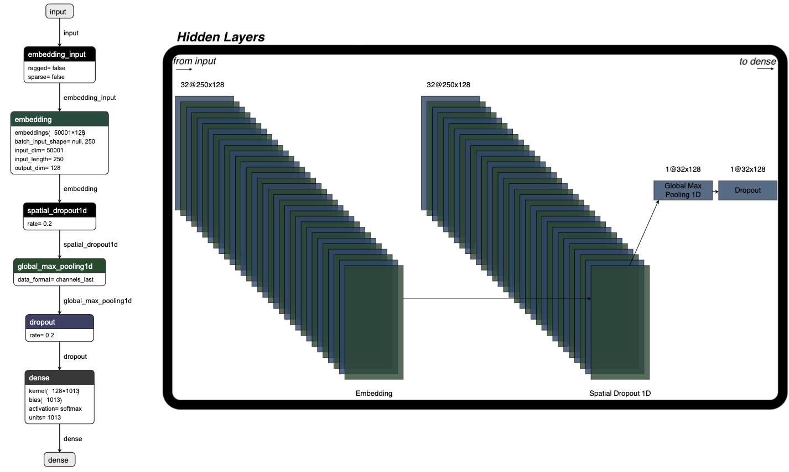

# ds
## File Structure
```
.
├── app_api
│   ├── app.py
│   ├── Dockerfile
│   ├── __init__.py
│   ├── model
│   │   ├── keras_pred_subreddit_model_v5.h5
│   │   ├── keras_tokenizer_v5.pickle
│   │   ├── sklearn_label_encoder_v5.pickle
│   │   └── subreddit_info_cleaned.csv
│   ├── predict.py
│   ├── requirements.txt
│   └── templates
│       ├── about.html
│       ├── base.html
│       └── bootstrap_layout.html
├── code
│   ├── Code_for_API_Endpoint.ipynb
│   └── Subreddit_Predictor.ipynb
├── heroku_files
│   ├── heroku.yml
│   ├── notes.md
│   ├── Procfile
│   └── runtime.txt
├── LICENSE
├── Pipfile
├── Pipfile.lock
├── production
│   ├── Dockerfile
│   ├── model
│   │   ├── keras_pred_subreddit_model_v5.h5
│   │   ├── keras_tokenizer_v5.pickle
│   │   ├── sklearn_label_encoder_v5.pickle
│   │   └── subreddit_info_cleaned.csv
│   ├── pro_api.py
│   ├── pro_predict.py
│   └── requirements.txt
└── README.md
```
## Current file logic:
we have two applications in our file system. `app_api` is the root of our flask application that has a frontend, model prediction, and dockerfile for production. our `production` folder is the api for frontend to connect to, also had docker specific file. `heroku_files` is the files used for production onto heroku.

## Data Exploration:


<p align="center">
  
</p>


# Flask API for reddit - posthere

gaining acces to api via url:
```
http://production-dev3.us-east-1.elasticbeanstalk.com/predict
```
* final api for build week
* predict route expects json object with key of "port" and value is the users text they want predicted.

## pushing model to heroku from command line:
make sure heroku cli is installed ([instructions can be found here](https://devcenter.heroku.com/articles/heroku-cli)).

```
git add .

git commit -m "<message>"

heroku create <appname>

heroku git:remote -a <appname>

git push heroku master
```

## Implementation of docker image for heroku flask app.

docker: [download](https://www.docker.com/products/docker-desktop)

```
docker build -t <image name>:latest

docker run -it <image name>

docker stop <container id>

run flask app from local container:
    docker run -d -p 5000:5000 <image name>
```

make new app and push image to heroku:

```
heroku create <app name>

heroku container:push web --app <app name>

heroku container:release web --app <app name>
```

can update image with
```
heroku container:push web --app <app name>

heroku container:release web --app <app name>
```

## Implementing AWS Beanstalk entity

```
pip install pipx

pipx ensurepath

pipx install awsebcli

eb init

eb create
```

# Docker Workflow:

## Use:
when working with docker its important to understand the purposes of a image and
container. docker allows developers to create applications with standardized executable. when
working and developing an application that runs locally we can create a docker container
with the same variables as our virtual environment so other users can run our application
without the need of configuring dependencies and environment variables.

## Application:
we started working with docker because our tensorflow predictive model was to large
to host on heroku. while looking for solutions we discovered [this](https://medium.com/tarkalabs/docker-deployments-to-heroku-5802b14df4fa#:~:text=Slug%20size%20limit%3A%20The%20maximum,you%20are%20out%20of%20luck.) article describing heroku applications using heroku.

the first goal was figuring out how to run our application within the container and being
able to access it from outside it. we used another [article](https://medium.com/@FelipeFaria/running-a-simple-flask-application-inside-a-docker-container-b83bf3e07dd5)
to understand the work flow of this docker image to build ours. the only difference between this
rendition and ours is how we formatted the application. in the `if __name__ == "__main__` we created the instance of the application when the file is called upon similar to the article. when the file was called the application starts.

this moves us into docker to "store" and use our application.

## Docker In Production:
the main issue we ran into was trying to understand the Dockerfile purpose and syntax. have has a total of 20 minutes of docker experience between the four of us the majority of our time was trouble shooting the docker container.

we initially started with an instance of alpine linux machine to run our docker image
but after several failed attempts and a quick reverence to the [docker](https://hub.docker.com/_/python) python documentation we settled on a pure instance of python to run our docker image.

we froze our pipfile and created a requirement,txt that can be downloaded into the container. created a directory, stored the current code to that directory then ran the application via [syntax](https://docs.docker.com/develop/develop-images/dockerfile_best-practices/)
in the Dockerfile.

we then build the docker container via command line and tested outside port access. once that was
up and running we implemented the image onto [heroku](https://devcenter.heroku.com/articles/heroku-cli-commands)


# Model Architecture


